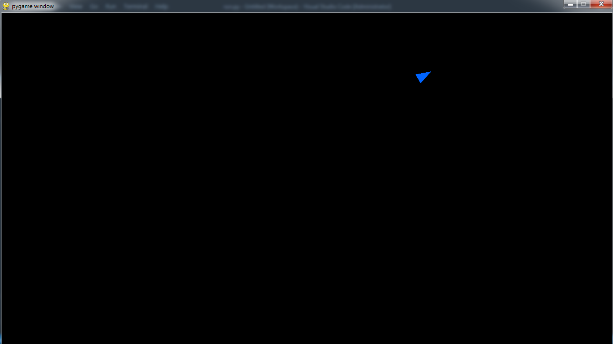

## Rocket game

This is a game implemented with pygame module. I lounched OOP initial commit as a implementation of two python classes.
- class Game
- class Rocket

## Install dependieces
```
pipenv install

# run the game
python run.py
```

Command <i>python run.py</i> opens the new window with the rocket as a triangle in bottom-left corner.



## Challenge

Get the initial view of pygame application.

## Development process

Class Game is a init module of the game with the customized configuration. Actions of the rocket are made inside class Rocket.

Game has the customized physics speed, velocity, acceleration, air resistance and gravity.


* version 1.0.0
* license MIT

created by mikey.prus@gmail.com

